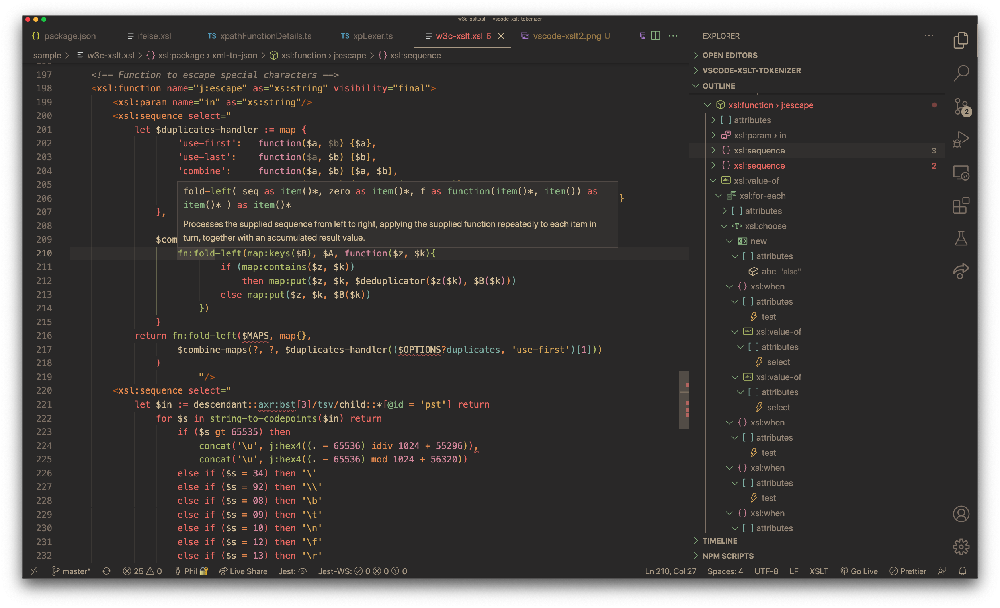
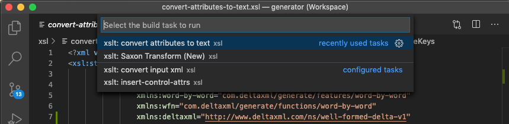

# XSLT/XPath for Visual Studio Code

The XSLT/XPath extension for VSCode provides comprehensive language support for XSLT 3.0 and XPath 3.1.




*Screenshot showing XSLT symbol-outline, problem-reporting and syntax-highlighting:*
## Features

 - XSLT 3.0 / XPATH 3.1
 - Syntax Highlighter uses [Semantic Highlighting](https://code.visualstudio.com/api/language-extensions/semantic-highlight-guide) exclusively
 - Built-in Code Diagnostics
 - Integration with [Saxon/Saxon-JS XSLT Processors](http://www.saxonica.com/products/products.xml)
 - XSLT Language support for VSCode features:
   - [Auto Completion/Intellisense](https://code.visualstudio.com/docs/editor/intellisense)
   - [Syntax Highlighting Themes](https://code.visualstudio.com/docs/getstarted/themes)
   - [Code Formatting](https://code.visualstudio.com/docs/editor/codebasics#_formatting)
   - [Code Folding](https://code.visualstudio.com/docs/editor/codebasics#_folding)
   - [Snippets](https://code.visualstudio.com/docs/editor/userdefinedsnippets) for XSLT/XPath context
   - [Code symbol outline](https://code.visualstudio.com/docs/getstarted/userinterface#_outline-view)
   - [Goto Symbol](https://code.visualstudio.com/Docs/editor/editingevolved#_peek)
   - [Symbol Breadcrumbs](https://code.visualstudio.com/docs/getstarted/userinterface#_breadcrumbs)
   - [Goto Definition](https://code.visualstudio.com/Docs/editor/editingevolved#_go-to-definition)
   - [Peek Definition](https://code.visualstudio.com/Docs/editor/editingevolved#_peek)
   - [VScode Tasks](https://code.visualstudio.com/Docs/editor/tasks) include custom [XSLT Tasks](https://github.com/DeltaXML/vscode-xslt-tokenizer/wiki/XSLT-Tasks)
   - [Bracket Matching](https://code.visualstudio.com/Docs/editor/editingevolved#_bracket-matching)
   - [Errors and Warnings](https://code.visualstudio.com/Docs/editor/editingevolved#_errors-warnings) for XSLT/XPath Syntax
 -  Follow `xsl:include`/`xsl:import` links
 - Custom XML Editing Featues:
   - XML Context-Aware Snippets
   - XML Well-Formedness Checking
   - Tag Rename
   - Auto tag-close
   - Auto clean orphaned end tag after `/` added to make start tag self-close

 
 ## Introduction
 
For lexical analysis, this extension processes code character-by-character. This analysis is exploited for all features including *all* syntax highlighting. Avoiding the much more common use of regular expressions on a line-by-line basis brings significant benefits. These benefits include improved responsiveness, lower CPU load, improved code maintainability and full integrity for syntax highlighting.

Auto-completion is available for XSLT and XPath, including contex-aware completion items for all code symbol names. XSLT and XPATH function signatures and descriptions are shown alongside fuction completion items.

This extension performs a comprehensive set of checks on the code, before any XSLT compilation. Thsese checks ensure that any code symbols within XSLT or XPath with problems are accurately identified at the symbol-level. Asynchronous processing for xsl:include/xsl:import dependencies allows checking of references to symbol definitions regardless of the location of the definition.

## Running XSLT



*XSLT transforms are configured and run as special VSCode Tasks*

For more detail, see [XSLT Tasks](https://github.com/DeltaXML/vscode-xslt-tokenizer/wiki/XSLT-Tasks)

## Release Notes

See: [Release Notes](https://github.com/DeltaXML/vscode-xslt-tokenizer/wiki/Release-Notes) on the project wiki

## Sample Screenshots

See: [XSLT/XPath Wiki](https://github.com/DeltaXML/vscode-xslt-tokenizer/wiki/)

## Settings Options

See: [VSCode Settings](https://code.visualstudio.com/docs/getstarted/settings)

To use the task-provider for the _Java_ Saxon XSLT Processor, the following setting is required (alter path to suit actual jar location):

```
  "XSLT.tasks.saxonJar": "/path/to/folder/SaxonHE10-0J/saxon-he-10.0.jar"
```

## Formatting

### VSCode Formatting Command Keyboard Shortcuts
1. *On Windows* - ```Shift + Alt + F```.
2. *On Mac* - ```Shift + Option + F```.
3. *On Ubuntu* - ```Ctrl + Shift + I```.

### Editor Settings for Highlighting in Color Theme Extensions

Syntax highlighting is currently only enabled by default in VSCode's built-in themes. This is because some extension themes may not yet have specific language support for VSCode's 'Semantic Highlighting' as used by this extension.

To enable syntax highighting for a custom theme you need to change User Settings. For example, to enable syntax highlighting for XSLT in the *City Lights* theme use:
```json
{
    "editor.semanticTokenColorCustomizations":{
      "[Monokai +Blue]": {"enabled": true}
    },
}
  ```

Or, to enable syntax highlighting for all themes:

```json
{
    "editor.semanticTokenColorCustomizations":{
      "enabled": true
    },
}
  ```

### Editor Settings For Formatting
```json
{
  "[xslt]": {
    "editor.defaultFormatter": "deltaxml.xslt-xpath",
    "editor.formatOnSave": true,
    "editor.formatOnPaste": true,
    "editor.formatOnType": true
  }
}
```
### Editor Settings For Word Selection/Navigation

For word selection/navigation, by default, names like $two-parts are treated as two words for selection purposes and $ is also excluded from the name. This behaviour can be altered using the VSCode setting: 

`editor.wordSeparators`

See: [VSCode Documentation on Settings](https://code.visualstudio.com/docs/getstarted/settings)

## Support for other languages with embedded XPath

In addition to XSLT, other XML-based languages/vocabularies with embedded XPath will be supported in future in this extension. Currently, DeltaXML's [Document Comparison Pipeline (DCP)](https://docs.deltaxml.com/xml-compare/latest/dcp-user-guide-9340381.html) format is supported, acting as a pilot for other languages.


