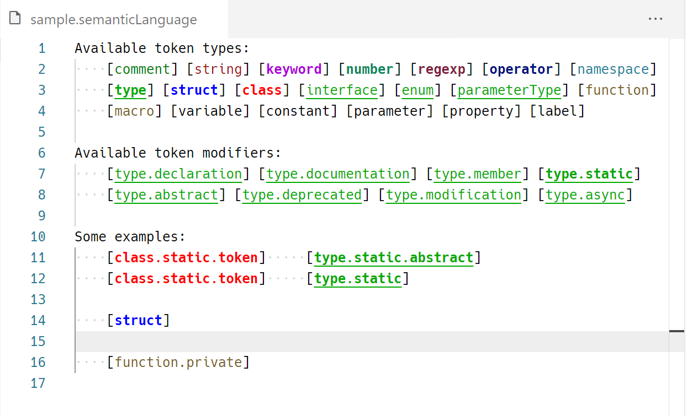

# XPath Semantic tokens sample

This extends the Semantic tokens sample to work with an XPath lexer. This semantic tokens provider always returns all the tokens in a file.



## To install dependencies
From terminal, run:

 ``npm install``

## How to run

Launch the extension and open the file `sample/basic.xpath` and use the following settings:

```json
"editor.tokenColorCustomizationsExperimental": {
	"*.static": {
		"foreground": "#ff0000",
		"fontStyle": "bold"
	},
	"type": {
		"foreground": "#00aa00"
	}
}
```
