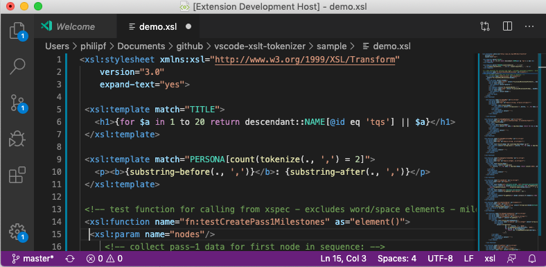
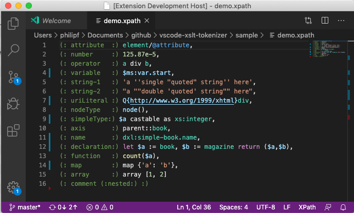

# XSLT 3.0 / XPath 3.1 Semantic tokens

_This project exploits the proposed API for Semantic Tokens VSCode Extensions._

This is a VSCode extension for the semantic highlighting of XSLT and XPath.

Currently, semantic token types are provided, semantic token modifiers will be added later. The tokens are used for XPath syntax highlighting, either for standalone XPath files or for XPath expressions embedded within XSLT.

The XSLT demo file loaded in VSCode with the extension running:



The XPath demo file loaded in VSCode with the extension running:



## To install dependencies
From terminal, run:

 ``npm install``

## Settings

Settings.json (in application directory)

```json
{
	"[typescript]": {},
	"git.enableSmartCommit": true,
	"git.autofetch": true,
	"[XPath]": {
		"editor.matchBrackets": "always",
		"editor.semanticHighlighting.enabled":true
	},
	"window.zoomLevel": 0,
	"editor.matchBrackets": "always",
	"[xsl]": {
		"editor.semanticHighlighting.enabled":true
	}
}
```

## How to run

Launch the extension and open the file `sample/basic.xpath`.

(Once the semantics tokens are complete) use the following settings:

```json
"editor.tokenColorCustomizationsExperimental": {
	"*.static": {
		"foreground": "#ff0000",
		"fontStyle": "bold"
	},
	"type": {
		"foreground": "#00aa00"
	}
}
```

## How to test XPath Lexer

From terminal, run:

``npm test``

## State of development

- This is currently a work in progress. Main XPath 3.1 tokenization using standard token types is complete.

To do:
- Highlight non-XSLT element names
- Use XSLT namespace instead of xsl: prefix
- Configure XSL language for matching-brackets

## XPath 3.1 lexer summary

### Main Features
- Hand-crafted lexer
- No regular expressions
- Iterates character by character
- Single pass with 1-character lookahead
- Disambiguates token based on previous/next token
- Uses stack to manages evaluation context scope
- No Abstract Syntax Tree
- Optional 'Context' Tree (not used by semantic highlighter)

### Diagnostics / Testing
- Set of high-level tests - uses jest/ts-jest
- Generate tests from XPath expressions
- XPath Diagnosticts Tool
	- Lists all tokens for given XPath
	- Each token type and main properties

## Sample Diagnostics:

### Character-level:
```
path: let $ac := function($a) as function(*) {function($b) {$b + 1}} return $a
===============================================================================================================
Cached Real Token                                 New Token       Value                         line:startChar
===============================================================================================================
                                                  lName           let_                              0:0
lName           let_                              lWs              _                                0:3
lName           let_                              lVar            $ac_                              0:4
lVar            $ac_                              lWs              _                                0:7
lVar            $ac_                              dSep            :=_                               0:8
dSep            :=_                               lWs              _                                0:10
dSep            :=_                               lName           function_                         0:11
```
### Token-level (Context enabled):

```
Value           Char-Type       Token-type
-------------------------------------------
let             lName           Declaration
$ac             lVar            Variable
:=              dSep            Declaration
--- children-start---
function        lName           Operator
(               lB              Operator
--- children-start---
$a              lVar            Variable
--- children-end ----
)               rB              Operator
as              lName           Operator
function        lName           SimpleType
(               lB              Operator
