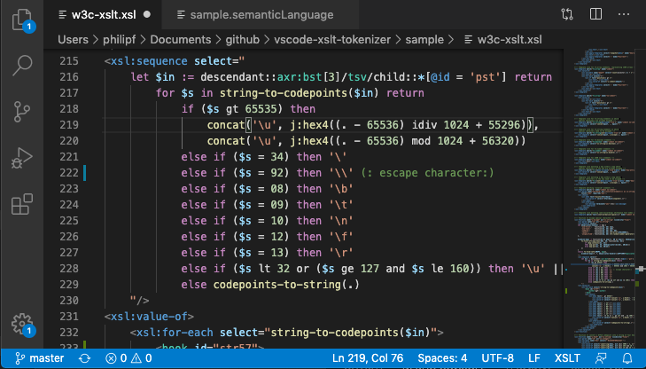
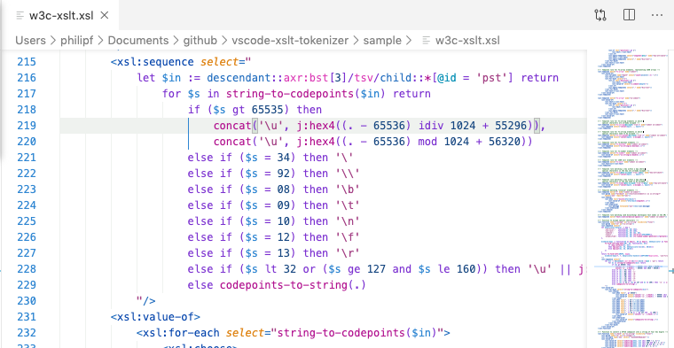
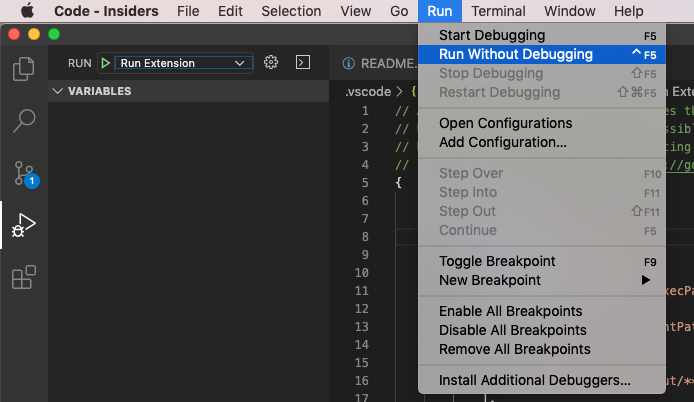

# XPath Rising

A VSCode extension for the syntax highlighting of XPath 3.1, XSLT 3.0 and other languages that host XPath.

This project uses the proposed API for Semantic Tokens VSCode Extensions. XPath Rising will be published to the VSCode Extension MarketPlace once the proposed API is incorporated into a stable release of VSCode.

_An XSLT sample file loaded in VSCode with the extension running:_



_Use your preferred highlighting theme:_



## How to run

The VSCode Insiders release is required. 

First launch VSCode Insiders. Then from the menu-bar, select *Run* > *Run Without Debugging*:



## How to run XPath Lexer tests

From terminal in project directory (when using for the first time):

 ```npm install```

 then:

 ```npm test```


## State of development

- The XSLT and XPath lexers now conform to the XSLT 3.0 and XPath 3.1 specifications to create appropiate semtantic token types. The types used are mapped to TM Grammar Scopes in the configuration in *package.json*. 

The TM Scopes used by this project are sufficient for the popular general-purpose syntax highlighting themes to provide effective syntax highlighting. These scopes will be refined later to provide more granularity to allow color themes to provide language-specfic highlighting.


## XSLT 3.0 and XPath 3.1 lexer summary

### Main Features
- Hand-crafted lexer
- No regular expressions
- Iterates character by character
- Single pass with 1-character lookahead
- Disambiguates token based on previous/next token
- Uses stack to manages evaluation context scope
- No Abstract Syntax Tree.

### Diagnostics / Testing
- A set of high-level tests for XPath 3.1 expressions
- Generate tests from XPath expressions
- XPath Diagnosticts Tool
	- Lists all tokens for given XPath
	- Each token type and main properties
- XSLT Diagnostics Tool
	- Currently, only lists values for each XSLT token
	
## Implementation Details:

The [Semantic Tokens API](https://github.com/microsoft/vscode/wiki/Semantic-Highlighting-Overview) used by *XPath Rising* provides for tokens with two main categories:
- Token Types - e.g. *keyword*, *variable*
- Token Modifiers - e.g. *documentation*, *static* 

## Sample Diagnostics:

### Character-level:
```
path: let $ac := function($a) as function(*) {function($b) {$b + 1}} return $a
===============================================================================================================
Cached Real Token                                 New Token       Value                         line:startChar
===============================================================================================================
                                                  lName           let_                              0:0
lName           let_                              lWs              _                                0:3
lName           let_                              lVar            $ac_                              0:4
lVar            $ac_                              lWs              _                                0:7
lVar            $ac_                              dSep            :=_                               0:8
dSep            :=_                               lWs              _                                0:10
dSep            :=_                               lName           function_                         0:11
```
### Token-level (Context enabled):

```
Value           Char-Type       Token-type
-------------------------------------------
let             lName           Declaration
$ac             lVar            Variable
:=              dSep            Declaration
--- children-start---
function        lName           Operator
(               lB              Operator
--- children-start---
$a              lVar            Variable
--- children-end ----
)               rB              Operator
as              lName           Operator
function        lName           SimpleType
(               lB              Operator
