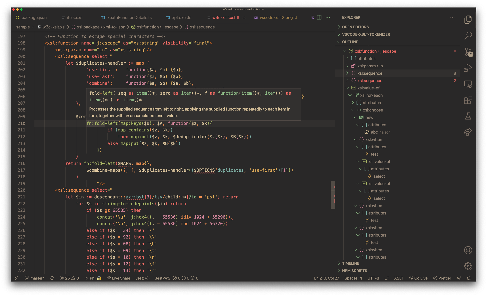
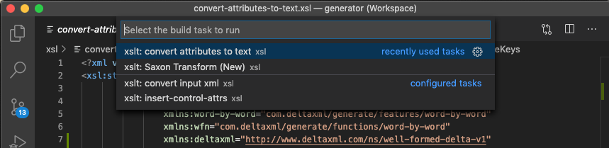
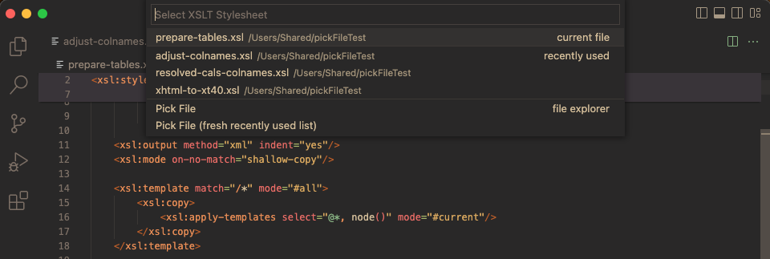

[](https://www.deltaxml.com/?utm_source=VisualStudio&utm_medium=Dev-Tools&utm_campaign=XSLT-XPATH)
# XSLT/XPath for Visual Studio Code

The XSLT/XPath extension for VSCode provides comprehensive language support for XSLT 3.0 and XPath 3.1, and for the XSLT 4.0 and XPath 4.0 features implemented in Saxon 13. This ReadMe is merely a 'quick start' guide, see the [XSLT/XPath User Guide](https://deltaxml.github.io/vscode-xslt-xpath/) for more comprehensive help.

---

<p align="center">
  <em>View of XSLT with syntax highlighting, formatting,problem reporting and node-outline:</em>
  
</p>


# XSLT/XPath Features

| Feature  | Details |
| ------- | ------- |
| **XSLT 3.0**    | Full language support for [XSLT 3.0](https://www.w3.org/TR/xslt-30/) and [XPath 3.1](https://www.w3.org/TR/xpath-31/)
| **XSLT 4.0**    | Language support for the [XSLT 4.0 features implemented in Saxon 13](https://www.saxonica.com/documentation13/index.html#!v4extensions) - including record and enum types, `xsl:item-type`, `xsl:switch` and documentation notes with `xsl:note` - see [XSLT 4.0](https://deltaxml.github.io/vscode-xslt-xpath/xslt40.html)
| **XPath 3.1**            | [Companion XPath Notebook extension](https://marketplace.visualstudio.com/items?itemName=deltaxml.xpath-notebook) tests XPaths against current XML file
| **SaxonJS 2 Interactive (IXSL)** | Language support for [Saxon interactive extensions](https://www.saxonica.com/saxon-js/documentation/index.html#!ixsl-extension)
| **Syntax Highlighting**   | Fast and precise - using [Semantic Highlighting](https://code.visualstudio.com/api/language-extensions/semantic-highlight-guide) exclusively
| **Code Formatting**       | XSLT instruction elements, attributes and multi-line XPath expressions
| **XSLT/XPath Linter\***   | For XPath Syntax, XSLT Instructions, cross-module variable/param references, all XPath symbols
| **XSLT/XPath Processing** | VS Code Task Support for [Saxon](https://www.saxonica.com/documentation13/index.html) ([Java](https://adoptopenjdk.net/installation.html)), [Saxon-JS](https://www.saxonica.com/saxon-js/documentation/index.html) ([NodeJS](https://nodejs.org/en/)) and [SaxonC](https://www.saxonica.com/saxon-c/index.xml)
| **Quick Run**             | Run the active stylesheet with Saxon (`⌘⌥R` / `Ctrl+Alt+R`, or the editor toolbar button) without configuring a task first - see [Quick Run](https://deltaxml.github.io/vscode-xslt-xpath/quick-run.html)
| **Auto-Completion**       | XSLT instructions, XPath functions/axis, XPath variables, XPath symbol names, Node names *(uses last XML opened in VS Code)*, snippets for XPath expressions, and `xsl:with-param` for each parameter of a called template
| **XPath Tester**          | Support for companion <a href="https://marketplace.visualstudio.com/items?itemName=deltaxml.xpath-notebook">XPath Notebook</a> extension for XML Analysis or XPath Testing
| **Color Theme Support**   | Tested with most popular color themes ([Semantic Highlighting](https://code.visualstudio.com/api/language-extensions/semantic-highlight-guide) must be enabled in settings) 
| **Inferred xsl:import**   | Open the 'master' XSLT module first. Now all subsequent XSLT modules opened infer 'missing' imports using the 'master'
| **Code Folding**          | Either uses indentation or `region` XML processing-instructions
| **Snippets**              | Set of snippets accessed via auto-completion
| **Symbol Outline**        | Tree-view of XSLT instructions *- this can be shown in the 'Side Panel' or 'Side Bar'*
| **Symbol Breadcrumbs**    | Shows location within the code hierarchy
| **Extract xsl:function**  | Refactors selected XSLT instructions or XPath expression passing fn args as required
| **Extract xsl:template**  | Refactors selected XSLT instructions passing xsl:params as required
| **Extract xsl:variable**  | Refactors selected XPath expression as an XSLT variable
| **Wrap with...**          | Wraps selected XSLT instructions in an instruction like `xsl:if` or `xsl:for-each`, chosen from those allowed at that point (`⌥⇧W` / `Alt+Shift+W`)
| **Extract record type**   | XSLT 4.0: creates an `xsl:item-type` record type from a map constructor or `xsl:map`
| **Rename Symbol**         | All in-scope usages of the symbol will be renamed - across all imported stylesheet modules 
| **Goto Symbol**           | Quick access via filterable list of code symbols
| **Goto Definition**       | For all symbol references like variables, parameters, functions, modes, accumulators etc.
| **Peek Definition**       | View symbol declarations inline with corresponding references
| **Goto (Peek) References**  | Inline view of references for variables, functions etc. *(includes references from imported modules)*
| **Find All References**       | View and navigate between all references for a selected symbol in the References Pane
| **VS Code Tasks**         | Configurable XSLT tasks for Saxon, Saxon-JS and SaxonC Processors - with user-input options
| **XSLT/XPath Linter**     | Checks syntax and integrity of symbol references across all imported modules
| **Follow Links**          | For `xsl:import`, `xsl:include` and `xsl:use-package`
| **Hover assistance**      | Shows tooltips. Providing signatures and descriptions for all built-in XSLT and XPath functions (with links to the W3C specification), and for user-defined functions and named templates
| **Signature Help**        | Parameter hints while typing the arguments of a function call, or the `xsl:with-param` children of an `xsl:call-template`
| **Variable watcher**      | Auto-complete for 'print-debugging' with `xsl:message` for in-scope XSLT/XPath variables - output shown in terminal at runtime - see [Debugging](https://deltaxml.github.io/vscode-xslt-xpath/code-diagnostics.html)
| **Colorised `xsl:message`** | use `xdm:debug()`/`xdm:debug-color()` to format and colorise XPath 3.1 types like maps and arrays
| **Documentation**         | Features are documented in the: [XSLT/XPath User Guide](https://deltaxml.github.io/vscode-xslt-xpath/) 
|||

   \* *Problem-reporting currently depends on the VSCode symbol-provider. To ensure problems are always reported in VSCode, use the following VSCode setting: `"breadcrumbs.enabled": true`*


# General XML Features
| Feature  | Details |
| ------- | ------- |
| **Well-formedness checking** | Checks XML syntax and checks prefixes against in-scope namespace declarations
| **XML Formatting**       | Indents XML elements, attributes and multi-line attribute-values
| **XML Tree-view**        | Outline of XML elements and attributes in document
| **XML Breadcrumbs**      | Shows ancestors of current XML node
| **Auto Tag-Close**       | Pressing `</` results in the auto-completion for the close tag of the current element
| **Tag Rename**           | When start-tag is modified, corresponding end-tag is also updated
| **Tag Self-Close**       | Convert start-tag to self-closed tag by inserting `/` before  `>` (end-tag is removed) 
| **Comment Command**    | keyboard shortcut: `⌘/` - convert lines to an XML comment
| **XML Snippets**         | For XML elements, attributes, processing-instructions and comments
|||

# XML Commands

The XML selection commands are also in the **XML Selection** submenu of the editor's context menu (right-click), and in the **XML: Select Element...** quick pick (`⇧⌘2` / `Ctrl+Shift+2`) - both show their key-bindings.

| Command  | Key-Binding (macOS / Windows, Linux) | Details |
| ------- | ------- | --------- |
| XML: Goto XPath |  | Initially shows current XPath at the text prompt  |
| XML: Select Element... | ⇧⌘2 / Ctrl+Shift+2 | Quick pick of the XML selection commands, and Goto XPath |
| XML: Select current element | ⇧⌘0 / Ctrl+Shift+0 | Includes start/end tags |
| XML: Select parent element | ⇧⌘9 / Ctrl+Shift+9 | Includes start/end tags |
| XML: Select first child element | ⇧⌘8 / Ctrl+Shift+8 | Includes start/end tags |
| XML: Select following element | ⇧⌘7 / Ctrl+Shift+7 | Includes start/end tags |
| XML: Select preceding element | ⇧⌘6 / Ctrl+Shift+6 | Includes start/end tags |
| XSLT: Add XSLT Inputs to Tasks File ||For file-selection prompt when running XSLT|
| New XPath Notebook | - | DeltaXignia's [XPath Notebook extension](https://marketplace.visualstudio.com/items?itemName=deltaxml.xpath-notebook) is required

 # Introduction
 
For lexical analysis, this extension processes code character-by-character. This analysis is exploited for all features including *all* syntax highlighting. Avoiding the much more common use of regular expressions on a line-by-line basis brings significant benefits. These benefits include improved responsiveness, lower CPU load, improved code maintainability and greater integrity for syntax highlighting.

**Auto-completion** is provided for XSLT and XPath. This includes context-aware completion items for all code symbol names. XSLT and XPATH function signatures and descriptions are shown in the description alongside function completion items. The last active non-XSLT file is used as the source to compute available node names for XPath location steps.

This extension's linter performs a comprehensive set of checks on the code. The linter ensures that any code symbols within XSLT or XPath with problems are accurately identified at the symbol-level. Asynchronous processing for xsl:include/xsl:import dependencies allows checking of references to symbol definitions regardless of the location of the definition.

# Running XSLT



The quickest way to run the stylesheet in the active editor is [Quick Run](https://deltaxml.github.io/vscode-xslt-xpath/quick-run.html) (`⌘⌥R` / `Ctrl+Alt+R`): the first run creates a task for you, which later runs reuse.

XSLT transforms for SaxonJava, SaxonJS and SaxonC are configured and run as special VSCode Tasks. 

XSLT task JSON properties can reference special commands. The special commands allow file-selection via a File Explorer or 'Recent Files' list, an example using: `"xsltFile": "${command:xslt-xpath:pickXsltFile}"`. A sample screenshot is shown below:



For more a full description on using VSCode tasks to run XSLT, see [Running XSLT](https://deltaxml.github.io/vscode-xslt-xpath/run-xslt.html).

# Release Notes

The project changelog is maintained on the project wiki. See [Release Notes](https://github.com/DeltaXML/vscode-xslt-tokenizer/wiki/Release-Notes).

# Extension Settings

To benefit from this extension, it's essential to make a few updates to VS Code's User or Workspace settings to your specific needs and environment.
This section outlines the main settings associated with XSLT features.

For more details on how these settings are managed within VS Code see: [VSCode Settings](https://code.visualstudio.com/docs/getstarted/settings)

## XSLT Tasks

To use the task-provider for the _Java_ Saxon XSLT Processor, the following setting is required (alter path to suit actual jar location):

```
  "XSLT.tasks.saxonJar": "/path/to/folder/SaxonHE12-9J/saxon-he-12.9.jar"
```

To use the task-provider for SaxonC, set the path of the folder containing the SaxonC command-line `Transform` executable:

```
  "XSLT.tasks.saxonCPath": "/path/to/folder/containing/Transform"
```

## XSLT 4.0 Tasks

XSLT 4.0 requires Saxon-PE or Saxon-EE (or the equivalent SaxonC edition). The task property `allowSyntaxExtensions40` defaults to `"auto"`, which enables XPath 4.0 syntax unless the processor is Saxon-HE.

When the `parse-html()` function is used, the following setting is also needed, e.g.:

```
  "XSLT.tasks.htmlParserJar": "/path/to/folder/htmlparser-1.4.jar" // or: nu.validator.jar
```

## XSLT Packages

If your XSLT contains xsl:use-package instructions, XSLT package names are resolved to lookup symbols to support the following features:

- Goto Definition
- Symbol Diagnostics
- Symbol Auto-Completion

 To allow XSLT package names to be resolved to file paths, package details should be added to the setting:

`XSLT.resources.xsltPackages`

An example of XSLT package name settings:

```json
"XSLT.resources.xsltPackages": [
       { "name": "example.com.package1", "version": "2.0", "path": "included1.xsl"},
       { "name": "example.com.package2", "version": "2.0", "path": "features/included2.xsl"},
       { "name": "example.com.package3", "version": "2.0", "path": "features/not-exists.xsl"}
]
```

If file paths are relative they are resolved from the first Visual Studio Code Workspace folder

*Note: Currently, XSLT Package versions are not used in package-name lookup*

## Formatting

This extension supports special XSLT code formatting. This can be invoked with a VS Code command and/or as you type, depending on your settings.

### VSCode Formatting Command Keyboard Shortcuts
1. *On Windows* - ```Shift + Alt + F```.
2. *On Mac* - ```Shift + Option + F```.
3. *On Ubuntu* - ```Ctrl + Shift + I```.

### Recommended Editor Settings For Formatting etc.

You should start with something like the following in the `settings.json` file: 
```json
{
  ...
  "[xslt]": {
        "editor.formatOnPaste": true,
        "editor.formatOnSave": false,
        "editor.formatOnSaveMode": "modifications",
        "editor.formatOnType": true,
        "editor.defaultFormatter": "deltaxml.xslt-xpath",
        "editor.detectIndentation": true,
        "editor.tabSize": 2,
        "editor.wordSeparators": "`~!@#$%^&*()=+[{]}\\|;:'\",.<>/?",
        "outline.showArrays": true,
        "breadcrumbs.showArrays": true,
        "editor.semanticHighlighting.enabled": true
  }
  ...
}
```

## Refactoring
A range of [code refactoring](https://deltaxml.github.io/vscode-xslt-xpath/editing-xslt.html#refactoring) features are supported, including **Rename Symbol**, **Extract Function** and, for XSLT 4.0, **Extract record type**. 

When XSLT code is refactored, instructions and expressions are revised when necessary to
ensure the code behaviour remains unchanged. For example, the **Extract Function** refactor revises all expressions requiring the context-item so the code compiles and runs as before.

## Editor Settings for Highlighting in Color Theme Extensions

Syntax highlighting is currently only enabled by default in VSCode's built-in themes. This is because some extension themes may not yet have specific language support for VSCode's 'Semantic Highlighting' as used by this extension.

To enable syntax highighting for a custom theme you need to change User Settings. A set of dark color themes, specially enhanced
for XSLT, are provided by the [XSLT Dark Themes](https://marketplace.visualstudio.com/items?itemName=deltaxml.xslt-dark-themes) extension. 

You can also customize
XSLT token colors. For example, to enable syntax highlighting for XSLT and add some customizations in the [Gruvbox Material Dark](https://marketplace.visualstudio.com/items?itemName=sainnhe.gruvbox-material) theme you could use:
```json
  "editor.semanticTokenColorCustomizations": {
    "[Gruvbox Material Dark]": {
      "enabled": true,
      "rules": {
        "xmlPunctuation": "#b75a1e",
        "anonymousFunction": "#d3869b",
        "xmlText": "#928374",
        "attributeNameTest": "#89b482",
        "elementName": "#d3869b"
      },
    }
  },
  ```

Or, to enable syntax highlighting for all themes:

```json
  "editor.semanticHighlighting.enabled": true,
  ```

## Editor Settings For Word Selection/Navigation

For word selection/navigation, by default, names like $two-parts are treated as two words for selection purposes and $ is also excluded from the name. This behaviour can be altered using the VSCode setting: 

`editor.wordSeparators`

See: [VSCode Documentation on Settings](https://code.visualstudio.com/docs/getstarted/settings)

## Code Folding

Code-folding currently works by indentation indicating the nesting level. So, if code-folding does not work as expected, try reformatting using (for MacOS) - ```Shift-⌥-F```.

**Region code-folding** is also supported. This can be useful, for example, for blocks of templates for a specific mode. To set a region code-folding block, surround it with `<?region?>` and `<?endregion?>` processing instructions. You may optionally include a label for the processing instructions, for example: 

```
  <?region reconstruct?>
    ...
  <?endregion reconstruct?>
```
___

# XSLT/XPath User Guide

The [XSLT/XPath User Guide](https://deltaxml.github.io/vscode-xslt-xpath/) provides an introduction to features supported by this extension for XSLT and XPath developers.

The main documentation pages are linked below:

- [Overview](https://deltaxml.github.io/vscode-xslt-xpath/index.html)
- [Editing XML](https://deltaxml.github.io/vscode-xslt-xpath/editing.html)
- [Editing XSLT/XPath](https://deltaxml.github.io/vscode-xslt-xpath/editing-xslt.html)
- [Code Navigation](https://deltaxml.github.io/vscode-xslt-xpath/navigation.html)
- [Quick Run](https://deltaxml.github.io/vscode-xslt-xpath/quick-run.html)
- [Running XSLT](https://deltaxml.github.io/vscode-xslt-xpath/run-xslt.html)
- [Debugging](https://deltaxml.github.io/vscode-xslt-xpath/code-diagnostics.html)
- [Settings](https://deltaxml.github.io/vscode-xslt-xpath/settings.html)
- [XSLT 4.0](https://deltaxml.github.io/vscode-xslt-xpath/xslt40.html)
- [XSLT 4.0: Records and Enums](https://deltaxml.github.io/vscode-xslt-xpath/xslt40-records.html)
- [XSLT 4.0: Documentation Notes](https://deltaxml.github.io/vscode-xslt-xpath/xslt40-notes.html)

---


## Support for other languages with embedded XPath

In addition to XSLT, other XML-based languages/vocabularies with embedded XPath will be supported in future in this extension. Currently, DeltaXignia's [Document Comparison Pipeline (DCP)](https://docs.deltaxml.com/xml-compare/latest/dcp-user-guide-9340381.html) format is supported, acting as a pilot for other languages.

---
_Project Sponsor Message:_

[](https://www.deltaxml.com/?utm_source=VisualStudio&utm_medium=Dev-Tools&utm_campaign=XSLT-XPATH)

>DeltaXignia specialise in management of change in structured content with solutions including XML and JSON compare and merge. Whether you are working with documents, data or code, DeltaXignia’s solutions provide the most reliable, efficient and accurate comparison and merge functions for managing structured content. <p>Comprehensive API’s, configurable output formats and full audit trail capabilities make DeltaXignia’s products perfect for integration with your current content management workflows or for embedding within existing editing and publishing products.
