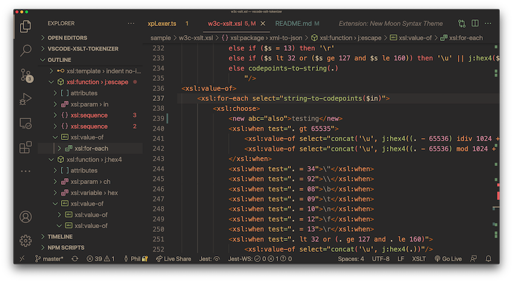

[](https://www.deltaxml.com/?utm_source=VisualStudio&utm_medium=Dev-Tools&utm_campaign=XSLT-XPATH)
# XSLT/XPath for Visual Studio Code

The XSLT/XPath extension for VSCode provides comprehensive language support for XSLT 3.0 and XPath 3.1.



# XSLT/XPath Features

| Feature  | Details |
| ------- | ------- |
| **XSLT 3.0/XPath 3.1**    | See W3C specifications for [XSLT](https://www.w3.org/TR/xslt-30/) and [XPath](https://www.w3.org/TR/xpath-31/)
| **Syntax Highlighting**   | Fast and precise - using [Semantic Highlighting](https://code.visualstudio.com/api/language-extensions/semantic-highlight-guide) exclusively
| **Code Formatting**       | XSLT instruction elements, attributes and multi-line XPath expressions
| **Code Diagnostics\***      | For: XPath Syntax, XSLT Instructions, XPath variable references, XPath symbols
| **XSLT/XPath Processing** | VS Code Task Support for [Saxon (Java)](https://www.saxonica.com/documentation10/index.html) and [Saxon-JS](https://www.saxonica.com/saxon-js/documentation/index.html)
| **Auto-Completion**       | XSLT instructions, XPath functions/axis, XPath variables, XPath symbol names, Node names etc.
| **Color Theme Support**   | Tested with most popular color themes ([Semantic Highlighting]() must be enabled in settings) 
| **Code Folding**          | Either uses indentation or `region` XML processing-instructions
| **Snippets**              | Set of snippets accessed via auto-completion
| **Symbol Outline**        | Tree-view of XSLT instructions and symbols (named templates, modes, variables, functions, accumulators etc.)
| **Symbol Breadcrumbs**    | Shows location within the code hierarchy
| **Goto Symbol**           | Quick access via filterable list of code symbols
| **Goto Definition**       | For all symbol references like variables, parameters, functions, modes, accumulators etc.
| **Peek Definition**       | View symbol declarations inline with corresponding references
| **VS Code Tasks**         | Configurable task templates for Saxon and Saxon-JS Prcoessors
| **Bracket Matching**      | For `()`, `{}`, and `[]`
| **Follow Links**          | For `xsl:import`, `xsl:include` and `xsl:use-package`
| **Hover assistance**      | Shows tooltips. Providing signatures and descriptions for all built-in XSLT and XPath functions
|||

   \* *Problem-reporting currently depends on the VSCode symbol-provider. To ensure problems are always reported in VSCode, use the following VSCode setting: `"breadcrumbs.enabled": true`*


# General XML Features
| Feature  | Details |
| ------- | ------- |
| **Well-formedness checking** | Checks XML syntax and checks prefixes against in-scope namespace declarations
| **XML Formatting**       | Indents XML elements, attributes and multi-line attribute-values
| **XML Tree-view**        | Outline of XML elements and attributes in document
| **XML Breadcrumbs**      | Shows ancestors of current XML node
| **Tag Rename**           | When start-tag is modified, corresponding end-tag is also updated
| **Tag Self-Close**       | Convert start-tag to self-closed tag by inserting `/` before  `>` (end-tag is removed) 
| **Selection Commands**   | `Select current`/`preceding`/`following`/`parent element`
| **`Goto XPath` Command**         | Enter XPath location in quick-editor (initally shows current XPath)
| **`Comment` Command**    | (`⌘/`) Convert lines to an XML comment
| **XML Snippets**         | For XML elements, attributes, processing-instrucitons and comments
|||

 # Introduction
 
For lexical analysis, this extension processes code character-by-character. This analysis is exploited for all features including *all* syntax highlighting. Avoiding the much more common use of regular expressions on a line-by-line basis brings significant benefits. These benefits include improved responsiveness, lower CPU load, improved code maintainability and full integrity for syntax highlighting.

Auto-completion is available for XSLT and XPath, this includes contex-aware completion items for all code symbol names. XSLT and XPATH function signatures and descriptions are shown in the description alongside function completion items.

This extension performs a comprehensive set of checks on the code, before any XSLT compilation. Thsese checks ensure that any code symbols within XSLT or XPath with problems are accurately identified at the symbol-level. Asynchronous processing for xsl:include/xsl:import dependencies allows checking of references to symbol definitions regardless of the location of the definition.

# Running XSLT


XSLT transforms are configured and run as special VSCode Tasks. For more detail, see [XSLT Tasks](https://github.com/DeltaXML/vscode-xslt-tokenizer/wiki/XSLT-Tasks)

# Release Notes

See: [Release Notes](https://github.com/DeltaXML/vscode-xslt-tokenizer/wiki/Release-Notes) on the project wiki

# Sample Screenshots

See: [XSLT/XPath Wiki](https://github.com/DeltaXML/vscode-xslt-tokenizer/wiki/)

# Extension Settings

See: [VSCode Settings](https://code.visualstudio.com/docs/getstarted/settings)

## XSLT Tasks

To use the task-provider for the _Java_ Saxon XSLT Processor, the following setting is required (alter path to suit actual jar location):

```
  "XSLT.tasks.saxonJar": "/path/to/folder/SaxonHE10-0J/saxon-he-10.0.jar"
```

The Saxon XSLT-Java and XSLT-JS TaskProviders are enabled by default. These can be enabled/disable using the following settings properties:

```
"XSLT.tasks.java.enabled": true
"XSLT.tasks.js.enabled": true
```

## XSLT Packages

If your XSLT contains xsl:use-package instructions, XSLT package names are resolved to lookup symbols to support the following features:

- Goto Definition
- Symbol Diagnostics
- Symbol Auto-Completion

 To allow XSLT package names to be resolved to file paths, package details should be added to the setting:

`XSLT.resources.xsltPackages`

An example of XSLT package name settings:

```json
"XSLT.resources.xsltPackages": [
       { "name": "example.com.package1", "version": "2.0", "path": "included1.xsl"},
       { "name": "example.com.package2", "version": "2.0", "path": "features/included2.xsl"},
       { "name": "example.com.package3", "version": "2.0", "path": "features/not-exists.xsl"}
]
```

If file paths are relative they are resolved from the first Visual Studio Code Workspace folder

*Note: Currently, XSLT Package versions are not used in package-name lookup*

## Formatting

### VSCode Formatting Command Keyboard Shortcuts
1. *On Windows* - ```Shift + Alt + F```.
2. *On Mac* - ```Shift + Option + F```.
3. *On Ubuntu* - ```Ctrl + Shift + I```.

### Editor Settings for Highlighting in Color Theme Extensions

Syntax highlighting is currently only enabled by default in VSCode's built-in themes. This is because some extension themes may not yet have specific language support for VSCode's 'Semantic Highlighting' as used by this extension.

To enable syntax highighting for a custom theme you need to change User Settings. For example, to enable syntax highlighting for XSLT in the *City Lights* theme use:
```json
{
    "editor.semanticTokenColorCustomizations":{
      "[Monokai +Lights]": {"enabled": true}
    },
}
  ```

Or, to enable syntax highlighting for all themes:

```json
{
    "editor.semanticTokenColorCustomizations":{
      "enabled": true
    },
}
  ```

### Editor Settings For Formatting
```json
{
  "[xslt]": {
    "editor.defaultFormatter": "deltaxml.xslt-xpath",
    "editor.formatOnSaveMode": "modifications",
    "editor.formatOnSave": true,
    "editor.formatOnPaste": true,
    "editor.formatOnType": true
  }
}
```
### Editor Settings For Word Selection/Navigation

For word selection/navigation, by default, names like $two-parts are treated as two words for selection purposes and $ is also excluded from the name. This behaviour can be altered using the VSCode setting: 

`editor.wordSeparators`

See: [VSCode Documentation on Settings](https://code.visualstudio.com/docs/getstarted/settings)

## Code Folding

Code-folding currently works by indentation indicating the nesting level. So, if code-folding does not work as expected, try reformatting using (for MacOS) - ```Shift-⌥-F```.

**Region code-folding** is also supported. This can be useful, for example, for blocks of templates for a specific mode. To set a region code-folding block, surround it with `<?region?>` and `<?endregion?>` processing instructions. You may optionally include a label for the processing instructions, for example: 

```
  <?region reconstruct?>
    ...
  <?endregion reconstruct?>
```
___

# Visual Studio Code Features

For reference, links to built-in Visual Studio Code language features that are supported/enhanced by this extension are listed below:
   - [Auto Completion/Intellisense](https://code.visualstudio.com/docs/editor/intellisense)
   - [Syntax Highlighting Themes](https://code.visualstudio.com/docs/getstarted/themes)
   - [Code Formatting](https://code.visualstudio.com/docs/editor/codebasics#_formatting)
   - [Code Folding](https://code.visualstudio.com/docs/editor/codebasics#_folding)
   - [Snippets](https://code.visualstudio.com/docs/editor/userdefinedsnippets) for XSLT/XPath context
   - [Code symbol outline](https://code.visualstudio.com/docs/getstarted/userinterface#_outline-view)
   - [Goto Symbol](https://code.visualstudio.com/Docs/editor/editingevolved#_peek)
   - [Symbol Breadcrumbs](https://code.visualstudio.com/docs/getstarted/userinterface#_breadcrumbs)
   - [Goto Definition](https://code.visualstudio.com/Docs/editor/editingevolved#_go-to-definition)
   - [Peek Definition](https://code.visualstudio.com/Docs/editor/editingevolved#_peek)
   - [VScode Tasks](https://code.visualstudio.com/Docs/editor/tasks) include custom [XSLT Tasks](https://github.com/DeltaXML/vscode-xslt-tokenizer/wiki/XSLT-Tasks)
   - [Bracket Matching](https://code.visualstudio.com/Docs/editor/editingevolved#_bracket-matching)
   - [Errors and Warnings](https://code.visualstudio.com/Docs/editor/editingevolved#_errors-warnings) for XSLT/XPath Syntax *

---


## Support for other languages with embedded XPath

In addition to XSLT, other XML-based languages/vocabularies with embedded XPath will be supported in future in this extension. Currently, DeltaXML's [Document Comparison Pipeline (DCP)](https://docs.deltaxml.com/xml-compare/latest/dcp-user-guide-9340381.html) format is supported, acting as a pilot for other languages.

---
[](https://www.deltaxml.com/?utm_source=VisualStudio&utm_medium=Dev-Tools&utm_campaign=XSLT-XPATH)

_Project Sponsor Message:_

>DeltaXML specialise in management of change in structured content with products for XML and JSON compare and merge. Whether you are working with documents, data or code, DeltaXML’s products provide the most reliable, efficient and accurate comparison and merge functions for managing XML-based content. <p>Comprehensive API’s, configurable output formats and full audit trail capabilities make DeltaXML’s products perfect for integration with your current content management workflows or for embedding within existing editing and publishing products. <p>See our products and download an evaluation [here](https://www.deltaxml.com/?utm_source=VisualStudio&utm_medium=Dev-Tools&utm_campaign=XSLT-XPATH):
