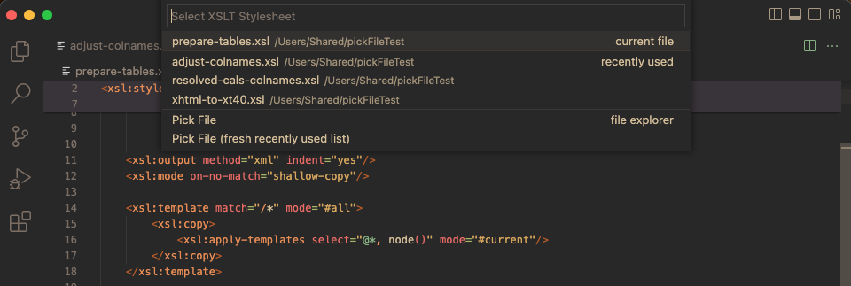

[](https://www.deltaxml.com/?utm_source=VisualStudio&utm_medium=Dev-Tools&utm_campaign=XSLT-XPATH)
# XSLT/XPath for Visual Studio Code

The XSLT/XPath extension for VSCode provides comprehensive language support for XSLT 3.0 and XPath 3.1. This ReadMe is merely a 'quick start' guide, see the [XSLT/XPath User Guide](https://deltaxml.github.io/vscode-xslt-xpath/) for more comprehensive help.

---

<p align="center">
  <em>View of XSLT with syntax highlighting, formatting,problem reporting and node-outline:</em>
  
</p>


# XSLT/XPath Features

| Feature  | Details |
| ------- | ------- |
| **XSLT 3.0**    | Full language support for [XSLT 3.0](https://www.w3.org/TR/xslt-30/) and [XPath 3.1](https://www.w3.org/TR/xpath-31/)
| **XSLT 4.0 (proposed)**    | Basic language support (work in progress) for [Saxon Experimental 4.0 extensions](https://www.saxonica.com/documentation11/index.html#!v4extensions)
| **XPath 3.1**            | [Companion XPath Notebook extension](https://marketplace.visualstudio.com/items?itemName=deltaxml.xpath-notebook) tests XPaths against current XML file
| **SaxonJS 2 Interactive (IXSL)** | Language support for [Saxon interactive extensions](https://www.saxonica.com/saxon-js/documentation/index.html#!ixsl-extension)
| **Syntax Highlighting**   | Fast and precise - using [Semantic Highlighting](https://code.visualstudio.com/api/language-extensions/semantic-highlight-guide) exclusively
| **Code Formatting**       | XSLT instruction elements, attributes and multi-line XPath expressions
| **Code Diagnostics\***      | For XPath Syntax, XSLT Instructions, variable/param references, all XPath symbols
| **XSLT/XPath Processing** | VS Code Task Support for [Saxon](https://www.saxonica.com/documentation10/index.html) ([Java](https://adoptopenjdk.net/installation.html)) and [Saxon-JS](https://www.saxonica.com/saxon-js/documentation/index.html) ([NodeJS](https://nodejs.org/en/))
| **Auto-Completion**       | XSLT instructions, XPath functions/axis, XPath variables, XPath symbol names, Node names *(uses last XML opened in VS Code)*
| **XPath Tester**          | Support for companion <a href="https://marketplace.visualstudio.com/items?itemName=deltaxml.xpath-notebook">XPath Notebook</a> extension for XML Analysis or XPath Testing
| **Color Theme Support**   | Tested with most popular color themes ([Semantic Highlighting]() must be enabled in settings) 
| **Inferred xsl:import**   | Open the 'master' XSLT module first. Now all subsequent XSLT modules opened infer 'missing' imports using the 'master'
| **Code Folding**          | Either uses indentation or `region` XML processing-instructions
| **Snippets**              | Set of snippets accessed via auto-completion
| **Symbol Outline**        | Tree-view of XSLT instructions *- this can be shown in the 'Side Panel' or 'Side Bar'*
| **Symbol Breadcrumbs**    | Shows location within the code hierarchy
| **Extract xsl:function**  | Refactors selected XSLT instructions or XPath expression passing fn args as required
| **Extract xsl:template**  | Refactors selected XSLT instructions passing xsl:params as required
| **Rename Symbol**         | All in-scope usages of the symbol will be renamed - across all imported stylesheet modules 
| **Goto Symbol**           | Quick access via filterable list of code symbols
| **Goto Definition**       | For all symbol references like variables, parameters, functions, modes, accumulators etc.
| **Peek Definition**       | View symbol declarations inline with corresponding references
| **Goto (Peek) References**  | Inline view of references for variables, functions etc. *(includes references from imported modules)*
| **Find All References**       | View and navigate between all references for a selected symbol in the References Pane
| **VS Code Tasks**         | Configurable XSLT tasks for Saxon and Saxon-JS Prcoessors - with user-input options
| **Bracket Matching**      | For `()`, `{}`, and `[]`
| **Follow Links**          | For `xsl:import`, `xsl:include` and `xsl:use-package`
| **Hover assistance**      | Shows tooltips. Providing signatures and descriptions for all built-in XSLT and XPath functions
| **Variable watcher**      | Auto-complete for `xsl:message` for local XSLT/XPath variables - output shown in terminal at runtime
|||

   \* *Problem-reporting currently depends on the VSCode symbol-provider. To ensure problems are always reported in VSCode, use the following VSCode setting: `"breadcrumbs.enabled": true`*


# General XML Features
| Feature  | Details |
| ------- | ------- |
| **Well-formedness checking** | Checks XML syntax and checks prefixes against in-scope namespace declarations
| **XML Formatting**       | Indents XML elements, attributes and multi-line attribute-values
| **XML Tree-view**        | Outline of XML elements and attributes in document
| **XML Breadcrumbs**      | Shows ancestors of current XML node
| **Auto Tag-Close**       | Pressing `</` results in the auto-completion for the close tag of the current element
| **Tag Rename**           | When start-tag is modified, corresponding end-tag is also updated
| **Tag Self-Close**       | Convert start-tag to self-closed tag by inserting `/` before  `>` (end-tag is removed) 
| **Comment Command**    | keyboard shortcut: `⌘/` - convert lines to an XML comment
| **XML Snippets**         | For XML elements, attributes, processing-instrucitons and comments
|||

# XML Commands
| Command  | Key-Binding | Details |
| ------- | ------- | --------- |
| XML: Goto XPath |  | Initially shows current XPath at the text prompt  |
| XML: Select current element | ⇧⌘0 | Includes start/end tags |
| XML: Select parent element | ⇧⌘9 | Includes start/end tags |
| XML: Select child element | ⇧⌘8 | Includes start/end tags |
| XML: Select following element | ⇧⌘7 | Includes start/end tags |
| XML: Select preceding element | ⇧⌘6 | Includes start/end tags |
| New XPath Notebook | - | DeltaXML's [XPath Notebook extension](https://marketplace.visualstudio.com/items?itemName=deltaxml.xpath-notebook) is required

 # Introduction
 
For lexical analysis, this extension processes code character-by-character. This analysis is exploited for all features including *all* syntax highlighting. Avoiding the much more common use of regular expressions on a line-by-line basis brings significant benefits. These benefits include improved responsiveness, lower CPU load, improved code maintainability and full integrity for syntax highlighting.

**Auto-completion** is provided for XSLT and XPath. This includes contex-aware completion items for all code symbol names. XSLT and XPATH function signatures and descriptions are shown in the description alongside function completion items. The last active non-XSLT file is used as the source to compute available node names for XPath location steps.

This extension's linter performs a comprehensive set of checks on the code. The linter ensures that any code symbols within XSLT or XPath with problems are accurately identified at the symbol-level. Asynchronous processing for xsl:include/xsl:import dependencies allows checking of references to symbol definitions regardless of the location of the definition.

# Running XSLT


XSLT transforms for SaxonJava and SaxonJS are configured and run as special VSCode Tasks. 

XSLT task JSON properties can reference special commands. The special commands allow file-selection via a File Explorer or 'Recent Files' list, an example using: `"xsltFile": "${command:xslt-xpath:pickXsltFile}"`. A sample screenshot is shown below:



For more a full description on using VSCode tasks to run XSLT, see [Running XSLT](https://deltaxml.github.io/vscode-xslt-xpath/run-xslt.html).

# Release Notes

The project changelog is maintained on the project wiki. See [Release Notes](https://github.com/DeltaXML/vscode-xslt-tokenizer/wiki/Release-Notes).

# Extension Settings

See: [VSCode Settings](https://code.visualstudio.com/docs/getstarted/settings)

## XSLT Tasks

To use the task-provider for the _Java_ Saxon XSLT Processor, the following setting is required (alter path to suit actual jar location):

```
  "XSLT.tasks.saxonJar": "/path/to/folder/SaxonHE10-0J/saxon-he-10.0.jar"
```

## XSLT Packages

If your XSLT contains xsl:use-package instructions, XSLT package names are resolved to lookup symbols to support the following features:

- Goto Definition
- Symbol Diagnostics
- Symbol Auto-Completion

 To allow XSLT package names to be resolved to file paths, package details should be added to the setting:

`XSLT.resources.xsltPackages`

An example of XSLT package name settings:

```json
"XSLT.resources.xsltPackages": [
       { "name": "example.com.package1", "version": "2.0", "path": "included1.xsl"},
       { "name": "example.com.package2", "version": "2.0", "path": "features/included2.xsl"},
       { "name": "example.com.package3", "version": "2.0", "path": "features/not-exists.xsl"}
]
```

If file paths are relative they are resolved from the first Visual Studio Code Workspace folder

*Note: Currently, XSLT Package versions are not used in package-name lookup*

## Formatting

### VSCode Formatting Command Keyboard Shortcuts
1. *On Windows* - ```Shift + Alt + F```.
2. *On Mac* - ```Shift + Option + F```.
3. *On Ubuntu* - ```Ctrl + Shift + I```.

### Editor Settings For Formatting
```json
{
  "[xslt]": {
    "editor.defaultFormatter": "deltaxml.xslt-xpath",
    "editor.formatOnSaveMode": "modifications",
    "editor.formatOnSave": true,
    "editor.formatOnPaste": true,
    "editor.formatOnType": true
  }
}
```

## Refactoring
A range of [code refactoring](https://deltaxml.github.io/vscode-xslt-xpath/editing-xslt.html#refactoring) features are supported, including **Rename Symbol** and **Extract Function**. 

When XSLT code is refactored, instructions and expressions are revised when necessary to
ensure the code behaviour remains unchanged. For example, the **Extract Function** refactor revises all expressions requiring the context-item so the code compiles and runs as before.

## Editor Settings for Highlighting in Color Theme Extensions

Syntax highlighting is currently only enabled by default in VSCode's built-in themes. This is because some extension themes may not yet have specific language support for VSCode's 'Semantic Highlighting' as used by this extension.

To enable syntax highighting for a custom theme you need to change User Settings. A set of dark color themes, specially enhanced
for XSLT, are provided by the [XSLT Dark Themes](https://marketplace.visualstudio.com/items?itemName=deltaxml.xslt-dark-themes) extension. 

You can also customize
XSLT token colors. For example, to enable syntax highlighting for XSLT and add some customizations in the [Gruvbox Material Dark](https://marketplace.visualstudio.com/items?itemName=sainnhe.gruvbox-material) theme you could use:
```json
  "editor.semanticTokenColorCustomizations": {
    "[Gruvbox Material Dark]": {
      "enabled": true,
      "rules": {
        "xmlPunctuation": "#b75a1e",
        "anonymousFunction": "#d3869b",
        "xmlText": "#928374",
        "attributeNameTest": "#89b482",
        "elementName": "#d3869b"
      },
    }
  },
  ```

Or, to enable syntax highlighting for all themes:

```json
  "editor.semanticHighlighting.enabled": true,
  ```

## Editor Settings For Word Selection/Navigation

For word selection/navigation, by default, names like $two-parts are treated as two words for selection purposes and $ is also excluded from the name. This behaviour can be altered using the VSCode setting: 

`editor.wordSeparators`

See: [VSCode Documentation on Settings](https://code.visualstudio.com/docs/getstarted/settings)

## Code Folding

Code-folding currently works by indentation indicating the nesting level. So, if code-folding does not work as expected, try reformatting using (for MacOS) - ```Shift-⌥-F```.

**Region code-folding** is also supported. This can be useful, for example, for blocks of templates for a specific mode. To set a region code-folding block, surround it with `<?region?>` and `<?endregion?>` processing instructions. You may optionally include a label for the processing instructions, for example: 

```
  <?region reconstruct?>
    ...
  <?endregion reconstruct?>
```
___

# XSLT/XPath User Guide

The [XSLT/XPath User Guide](https://deltaxml.github.io/vscode-xslt-xpath/) provides an introduction to features supported by this extension for XSLT and XPath developers:

- [Overview](https://deltaxml.github.io/vscode-xslt-xpath/index.html)
- [Editing XML](https://deltaxml.github.io/vscode-xslt-xpath/editing.html)
- [Editing XSLT/XPath](https://deltaxml.github.io/vscode-xslt-xpath/editing-xslt.html)
- [Code Navigation](https://deltaxml.github.io/vscode-xslt-xpath/navigation.html)
- [Running XSLT](https://deltaxml.github.io/vscode-xslt-xpath/run-xslt.html)
- [Settings](https://deltaxml.github.io/vscode-xslt-xpath/settings.html)

---


## Support for other languages with embedded XPath

In addition to XSLT, other XML-based languages/vocabularies with embedded XPath will be supported in future in this extension. Currently, DeltaXML's [Document Comparison Pipeline (DCP)](https://docs.deltaxml.com/xml-compare/latest/dcp-user-guide-9340381.html) format is supported, acting as a pilot for other languages.

---
[](https://www.deltaxml.com/?utm_source=VisualStudio&utm_medium=Dev-Tools&utm_campaign=XSLT-XPATH)

_Project Sponsor Message:_

>DeltaXML specialise in management of change in structured content with products for XML and JSON compare and merge. Whether you are working with documents, data or code, DeltaXML’s products provide the most reliable, efficient and accurate comparison and merge functions for managing XML-based content. <p>Comprehensive API’s, configurable output formats and full audit trail capabilities make DeltaXML’s products perfect for integration with your current content management workflows or for embedding within existing editing and publishing products. <p>See our products and download an evaluation [here](https://www.deltaxml.com/?utm_source=VisualStudio&utm_medium=Dev-Tools&utm_campaign=XSLT-XPATH):
